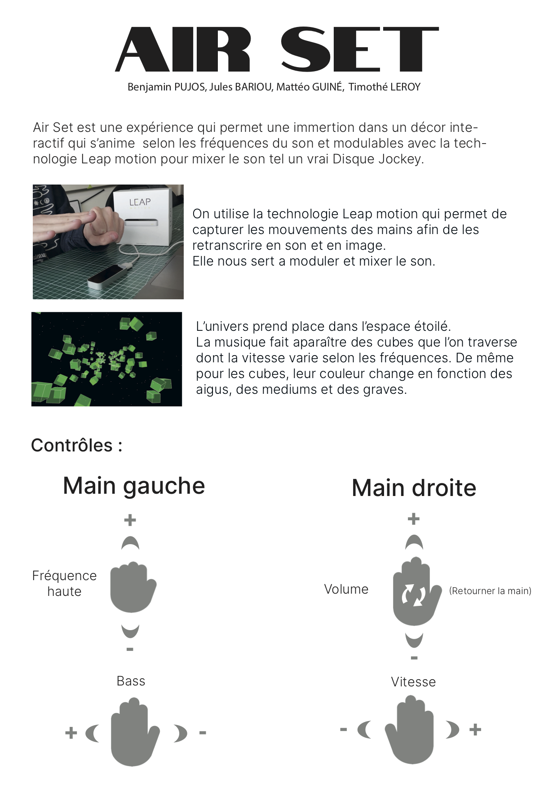
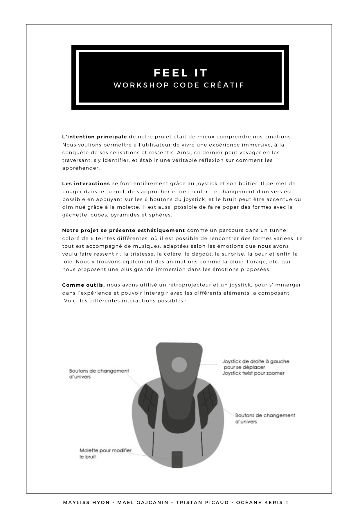

# workshop_code_creatif_2021

This repo holds the code and documentation for the creative coding workshop @lecolededesign. Production were made by students in 2nd year of interaction design using process. The **code** is available [github](https://github.com/AtelierNum/workshop_code_creatif_2021)

Full videos are available [here](https://github.com/AtelierNum/workshop_code_creatif_2021/releases/tag/1.0)

Cette page regroupe les projets réalisés par les étudiants de deuxième année en design d'interaction @lecolededesign. Le code est disponnible sur [github](https://github.com/AtelierNum/workshop_code_creatif_2021)

L'ensemble des vidéos de présentation des projets est disponible [ici](https://github.com/AtelierNum/workshop_code_creatif_2021/releases/tag/1.0)

## AirSet

Réalisé par : **Benjamin Pujos** - **Jules Bariou** - **Mattéo Guiné** - **Thimothé Leroy**

[Cahier de recherche](https://github.com/AtelierNum/workshop_code_creatif_2021/blob/master/AirSet/AirSet_Cahier_de_synthese.pdf)

## Blobby

Réalisé par : **Jeanne Hssein** - **Aliza Leb** - **Noémie Loyer** - **Pierre Moret**

[Cahier de recherche](https://github.com/AtelierNum/workshop_code_creatif_2021/blob/master/Blobbby/Blobby_Cahier_de_synthese.pdf)

## Charlie

Réalisé par : **Juliette Desmaisons** - **Clément Lambert** - **Charles Peaudeau** - **Juliette Pesneau**

Cahier de recherche vidéo à télécharger dans la rubrique release.

## Feel It

Réalisé par : **Océane Kerisit** - **Maël Gajcanin** - **Tristan Picaud** - **Maÿliss Hyon**

[Cahier de recherche](https://github.com/AtelierNum/workshop_code_creatif_2021/blob/master/FeelIt/FeelIt_CahierDeSynthese.pdf)

## Feel the universe

Réalisé par : **Zoé Gilbert** - **Jianing Leguen** - **Lola Voyer** - **Yiduo Yin**

[Cahier de recherche](https://github.com/AtelierNum/workshop_code_creatif_2021/blob/master/FeelTheUniverse/FeelTheUniverse_CahierDeSynthese.pdf)

## Louis, l'étoile tombée du ciel

Réalisé par : **Emilie Berrou** - **Eva Lamy** - **Clémence Fourcade** - **Manon Henrion**

[Cahier de recherche](https://github.com/AtelierNum/workshop_code_creatif_2021/blob/master/Louis/Louis_CahierDeSynthese.pdf)

## MidiModVizer

Réalisé par : **Eloi Dardenne**

[Cahier de recherche](https://github.com/AtelierNum/workshop_code_creatif_2021/blob/master/MidiModVizer/MidiModVizer_CahierDeSynthese.pdf)

## Munanyo

Réalisé par : **Théau Ducrocq** - **Gianmaria Corsi** - **Hugo Lamotte** - **Tristan Lijour**

[Cahier de recherche](https://github.com/AtelierNum/workshop_code_creatif_2021/blob/master/Munanyo/Munanyo_CahierDeSynthese.pdf)

## OuterSpace

Réalisé par : **Meng Wang** -  **Katell Elliot** - **Alexandra Madec** - **Mona-Lisa Esposito**

[Cahier de recherche](https://github.com/AtelierNum/workshop_code_creatif_2021/blob/master/OuterSpace/OuterSpace_Cahier_de_synthese.pdf)

## Sujet14

Réalisé par : **Esther Clapies** -  **Bruno De  Almeida** - **Léa Seill**

[Cahier de recherche](https://github.com/AtelierNum/workshop_code_creatif_2021/blob/master/Sujet14/Sujet14_Cahier_de_synthese.pdf)